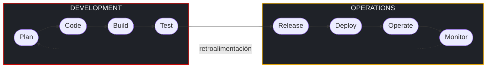
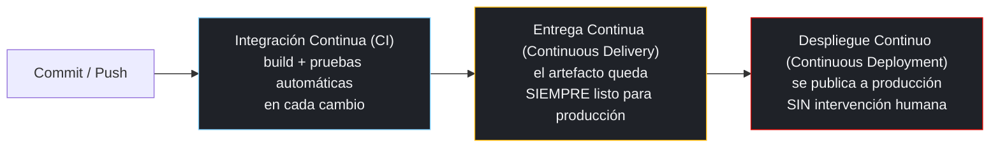
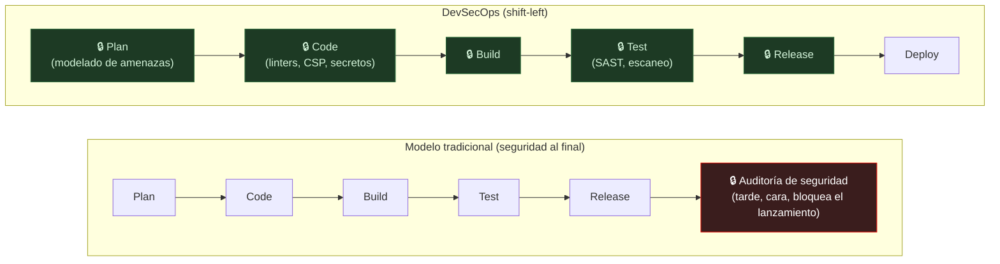
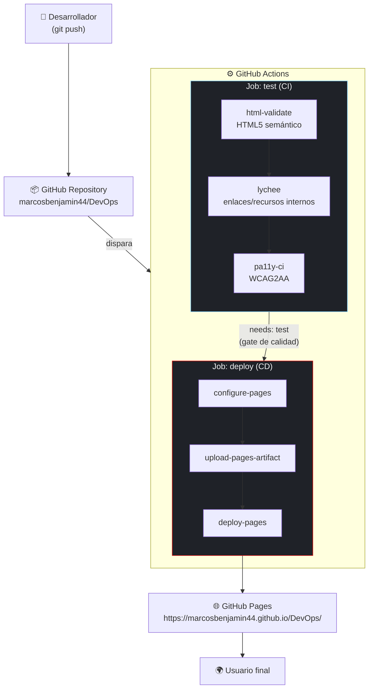
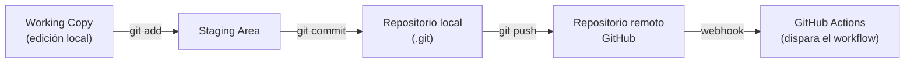
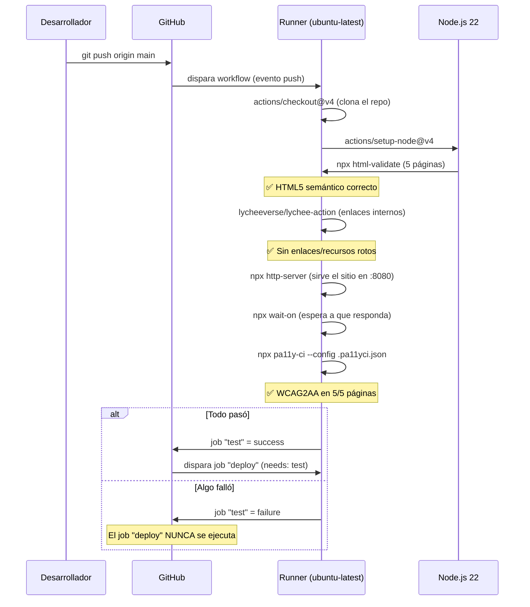
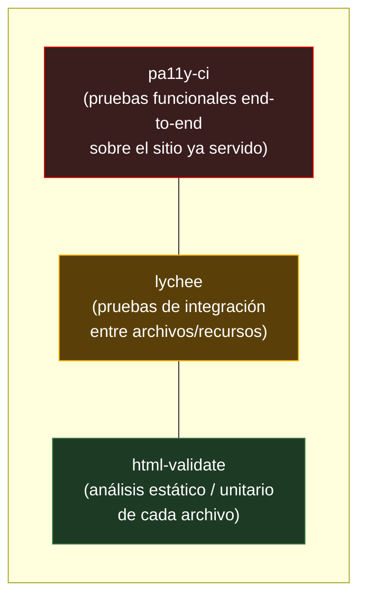
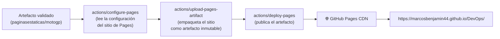
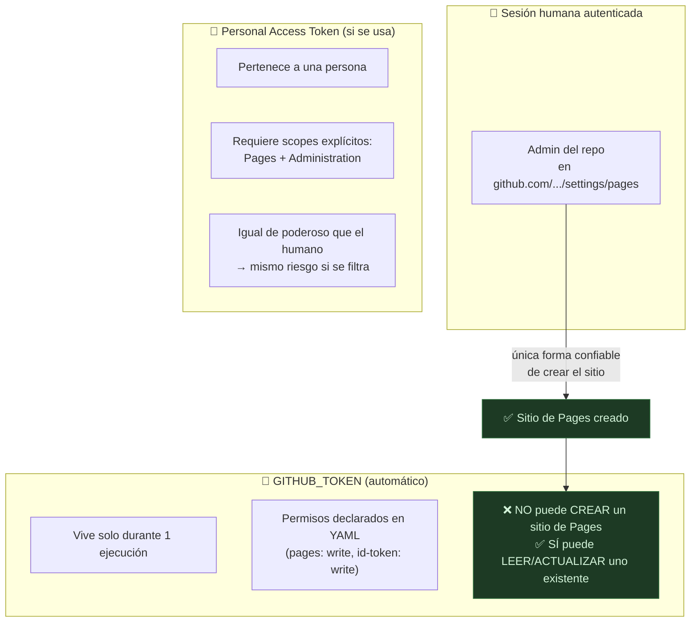
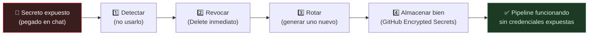

# DevOps, CI/CD y DevSecOps aplicados al proyecto MotoGP Fan Hub

> Documento de referencia técnica: explica la teoría de DevOps, Integración/Entrega
> Continua (CI/CD) y DevSecOps, y muestra —con evidencia real tomada de este mismo
> repositorio— cómo se aplicó cada concepto en las tres fases del flujo de trabajo:
> **Repository → Actions (pruebas) → Pages (despliegue)**.

## Índice

1. [Introducción](#1-introducción)
2. [Conceptos teóricos](#2-conceptos-teóricos)
   - [2.1 DevOps](#21-devops)
   - [2.2 CI/CD](#22-cicd-integración-y-entregadespliegue-continuos)
   - [2.3 DevSecOps](#23-devsecops)
3. [Arquitectura general del pipeline](#3-arquitectura-general-del-pipeline)
4. [Fase 1 — Repository](#4-fase-1--repository)
5. [Fase 2 — Actions: Integración Continua (pruebas)](#5-fase-2--actions-integración-continua-pruebas)
6. [Fase 3 — Pages: Entrega/Despliegue Continuo](#6-fase-3--pages-entregadespliegue-continuo)
7. [DevSecOps aplicado: casos reales de este proyecto](#7-devsecops-aplicado-casos-reales-de-este-proyecto)
8. [Shift-left: defectos reales atrapados por el pipeline](#8-shift-left-defectos-reales-atrapados-por-el-pipeline)
9. [Mapeo teoría → práctica (tabla resumen)](#9-mapeo-teoría--práctica-tabla-resumen)
10. [Glosario](#10-glosario)
11. [Referencias](#11-referencias)

---

## 1. Introducción

Este repositorio (`marcosbenjamin44/DevOps`) contiene un sitio estático
(`paginasestaticas/motogp`) y, sobre él, un pipeline completo de **Integración
Continua** y **Despliegue Continuo** implementado con **GitHub Actions** y
**GitHub Pages**. El objetivo de este documento no es repetir el *qué* (eso ya
lo documentan `paginasestaticas/motogp/README.md` e
`paginasestaticas/informe-auditoria-motogp.md`), sino explicar el **por qué**
desde la teoría de DevOps/CI-CD/DevSecOps, y **cómo cada concepto se
materializó en código real** dentro de este proyecto — incluyendo los
problemas reales que surgieron al desplegar y cómo se resolvieron, porque son
el mejor ejemplo práctico de varios principios que se explican más abajo.

---

## 2. Conceptos teóricos

### 2.1 DevOps

**DevOps** es una cultura y un conjunto de prácticas que buscan unir
**Development (Dev)** y **Operations (Ops)**, dos funciones que
tradicionalmente trabajaban separadas (los desarrolladores "tiraban el código
por la pared" y operaciones lo desplegaba). DevOps elimina esa pared mediante:

- **Colaboración y responsabilidad compartida**: quien escribe el código
  también es responsable de que funcione en producción.
- **Automatización** de todo lo repetible: build, pruebas, despliegue,
  infraestructura.
- **Retroalimentación continua y rápida**: cuanto antes se detecta un
  problema, más barato es corregirlo.
- **Mejora continua e iterativa**: entregas pequeñas y frecuentes en vez de
  "big bang releases".

El ciclo de vida de DevOps se suele representar como un lazo infinito de 8
etapas:



En **este proyecto**, ese lazo se ve así:

| Etapa DevOps | Dónde ocurre en este repo |
|---|---|
| Plan | Issues/decisiones registradas en `informe-auditoria-motogp.md` (auditoría → plan de acción priorizado) |
| Code | Commits en `paginasestaticas/motogp/*.html`, `css/`, `js/` |
| Build | No hay "build" tradicional (sitio estático), pero sí un *build lógico*: generación de `.webp`, validación de sintaxis |
| Test | Job `test` de `.github/workflows/pages.yml` (sección 5) |
| Release | Merge/push a `main` que pasa el job `test` |
| Deploy | Job `deploy` → `actions/deploy-pages` (sección 6) |
| Operate | El sitio corriendo en `https://marcosbenjamin44.github.io/DevOps/` |
| Monitor | `lychee` y `pa11y-ci` re-ejecutándose en cada push (monitoreo continuo de calidad, no solo "una vez") |

### 2.2 CI/CD (Integración y Entrega/Despliegue Continuos)

CI/CD son tres prácticas relacionadas pero distintas, que suelen confundirse:



- **Integración Continua (CI)**: cada vez que alguien integra código (push /
  pull request), un sistema automático lo compila y ejecuta pruebas. El
  objetivo es detectar errores de integración **en minutos**, no en semanas.
- **Entrega Continua (Continuous *Delivery*)**: además de CI, el resultado
  queda empaquetado como un artefacto desplegable en cualquier momento — pero
  la decisión de desplegar sigue siendo manual (por ejemplo, aprobar un
  ambiente de producción).
- **Despliegue Continuo (Continuous *Deployment*)**: un paso más allá —
  **si las pruebas pasan, se despliega automáticamente**, sin que un humano
  apruete un botón.

**Este proyecto implementa Despliegue Continuo real**: el job `deploy` de
`.github/workflows/pages.yml` corre automáticamente después de `test` en cada
push a `main`, sin ninguna aprobación manual:

```yaml
deploy:
  needs: test
  if: github.ref == 'refs/heads/main' && github.event_name != 'pull_request'
```

La cláusula `needs: test` es, literalmente, la implementación en código del
principio "no hay entrega sin que las pruebas pasen".

### 2.3 DevSecOps

**DevSecOps** extiende DevOps agregando la **seguridad como responsabilidad
compartida y automatizada**, en vez de un chequeo final hecho por un equipo
separado justo antes de producción (el modelo clásico, lento y tardío). Su
principio central es **"shift left"**: mover los controles de seguridad lo
más temprano posible en el ciclo de vida.



Pilares de DevSecOps que aparecen en este proyecto:

- **Seguridad como código**: la política de seguridad (CSP,
  Permissions-Policy) vive en los propios archivos `.html`, versionada en
  Git, no en un documento aparte.
- **Menor privilegio (least privilege)**: cada token/credencial debe tener
  el mínimo permiso posible, y solo mientras lo necesita.
- **Gestión de secretos**: nunca en texto plano en el código ni en
  conversaciones; siempre en un almacén cifrado (`Settings → Secrets`).
- **Automatización de controles**: un humano no tiene que "acordarse" de
  revisar la CSP en cada página — un linter/pipeline lo hace siempre.

---

## 3. Arquitectura general del pipeline



Tres fases, tres responsabilidades distintas — y no es casualidad que
coincidan con las tres preguntas del enunciado (**repository**, **actions**,
**pages**):

| Fase | Rol en DevOps | Rol en CI/CD |
|---|---|---|
| **Repository** | Fuente única de verdad ("Plan"+"Code") | Dispara el pipeline (`on: push`) |
| **Actions (test)** | Automatización + retroalimentación rápida | **CI**: valida cada cambio antes de integrarlo a `main` |
| **Pages (deploy)** | Operate | **CD**: entrega/despliegue continuo del artefacto validado |

---

## 4. Fase 1 — Repository

El repositorio Git es la base de **todo** lo demás: sin control de versiones
no hay "disparador" para CI, ni forma confiable de saber qué versión exacta
está en producción.

Decisiones tomadas aquí, y su justificación DevOps:

- **Rama única `main` (trunk-based-ish)**: para un proyecto de este tamaño,
  evita la complejidad de gestionar múltiples ramas de larga vida (que es
  precisamente lo que CI/CD busca evitar — "integration hell").
- **`.gitignore`**: evita que artefactos generados (`node_modules/`, logs)
  contaminen el historial — el repositorio debe contener *solo* la fuente de
  verdad.
- **Configuración como código**: `.htmlvalidate.json`, `.pa11yci.json` y el
  propio `.github/workflows/pages.yml` están *versionados junto al código*.
  Esto es una extensión del principio de **Infrastructure as Code**: las
  reglas de calidad/seguridad no viven "en la cabeza de alguien" ni en un
  documento Word — viven en Git, con historial, revisión por PR y
  reproducibilidad exacta en cualquier máquina (de hecho, se ejecutaron
  localmente con `npx` antes de subir el pipeline, con el mismo resultado
  que luego se vio en GitHub Actions).
- **Commits descriptivos y atómicos**: cada corrección del informe de
  auditoría se registró como un commit propio y trazable (ver `git log`),
  lo que en DevOps se llama *trazabilidad del cambio* — poder responder
  "¿cuándo y por qué se introdujo esto?" sin ambigüedad.



---

## 5. Fase 2 — Actions: Integración Continua (pruebas)

El job `test` de `.github/workflows/pages.yml` es la implementación concreta
de **CI**: automatiza exactamente lo que un revisor humano tendría que hacer
manualmente en cada cambio (y que, en la práctica, nadie hace de forma
consistente sin automatización).



### 5.1 Qué valida cada herramienta y por qué (teoría CI aplicada)

| Herramienta | Tipo de prueba | Qué detecta | Principio de CI que ejemplifica |
|---|---|---|---|
| `html-validate` | Análisis estático (linting) | Modelo de contenido HTML5 inválido, atributos ARIA mal usados, errores de sintaxis | **Fail fast**: un error de marcado se detecta en segundos, no cuando un usuario con lector de pantalla se topa con el bug |
| `lychee` | Prueba de integridad de recursos | Enlaces/CSS/JS/imágenes rotos (rutas relativas mal escritas, archivos renombrados y no actualizados) | **Regresión automática**: nadie tiene que acordarse de "revisar los links" a mano en cada cambio |
| `pa11y-ci` | Prueba funcional automatizada (levanta un navegador headless) | Incumplimientos reales de WCAG2AA (contraste, roles ARIA, estructura) sobre el HTML ya renderizado | **Quality gate objetivo**: no es "opinión" de un revisor, es una regla medible (ej. contraste ≥ 4.5:1) que pasa o falla |

Estas tres herramientas representan los tres niveles clásicos de la
"pirámide de pruebas" adaptados a un sitio estático:



Menos pruebas de este tipo, más rápidas y más baratas de ejecutar
(`html-validate`) van en la base y corren primero; las más costosas y
realistas (`pa11y-ci`, que levanta un Chromium completo) van arriba y corren
al final — así, si algo básico está roto, el pipeline falla en segundos en
vez de esperar minutos a que termine todo. Esto es exactamente el orden en
que están declarados los `steps` del job `test`.

### 5.2 El "gate" de calidad

La línea más importante de todo el pipeline, conceptualmente, es esta:

```yaml
deploy:
  needs: test
```

Sin esta línea, `test` y `deploy` serían dos procesos independientes y **el
sitio se publicaría aunque las pruebas fallaran** — es decir, no habría CI/CD
real, solo dos automatizaciones sueltas. `needs: test` convierte al job de
pruebas en un **quality gate**: una puerta que el código debe atravesar
—automáticamente, sin juicio humano— antes de llegar a producción.

---

## 6. Fase 3 — Pages: Entrega/Despliegue Continuo

Una vez que `test` pasa, el job `deploy` ejecuta el **Despliegue Continuo**:



Conceptos de CD que ilustra esta fase:

- **Despliegue basado en artefactos inmutables**: `upload-pages-artifact` no
  copia archivos "a mano" a un servidor — empaqueta el contenido de
  `paginasestaticas/motogp` como un artefacto versionado que luego
  `deploy-pages` publica tal cual, sin transformaciones intermedias. Esto
  garantiza que **lo que se probó es exactamente lo que se despliega** (una
  de las reglas de oro de CI/CD: "build once, deploy everywhere/anywhere").
- **Ambientes (`environment: github-pages`)**: GitHub Actions trata cada
  despliegue como una entrada en el historial del ambiente `github-pages`,
  con su propia URL y trazabilidad — el mismo concepto que "ambiente de
  producción" en cualquier plataforma cloud (Azure, AWS, Vercel).
- **Concurrencia controlada** (`concurrency: group: "pages"`): evita que dos
  despliegues se pisen entre sí si hay dos pushes casi simultáneos — un
  problema real de CD en equipos con más de una persona.

---

## 7. DevSecOps aplicado: casos reales de este proyecto

Esta sección es la más valiosa del documento porque **no es teoría
abstracta**: son problemas de seguridad reales que aparecieron al construir
este pipeline, y cómo la teoría de DevSecOps explica exactamente por qué
pasaron y cómo se resolvieron.

### 7.1 Seguridad como código: CSP y permisos mínimos

Desde el `informe-auditoria-motogp.md`, cada página HTML incluye:

```html
<meta http-equiv="Content-Security-Policy"
      content="default-src 'self'; script-src 'self'; style-src 'self';
                img-src 'self'; frame-src https://www.youtube-nocookie.com;
                object-src 'none'; base-uri 'self'; form-action 'self';" />
<meta http-equiv="Permissions-Policy"
      content="camera=(), microphone=(), geolocation=(), interest-cohort=()" />
```

Esto es **seguridad como código** en su forma más literal: la política no
depende de la configuración de un servidor externo que alguien podría
olvidar aplicar — viaja *dentro* del propio archivo versionado en Git. El
patrón "facade" del video de YouTube (no cargar el `<iframe>` hasta que el
usuario hace clic) es otro ejemplo: **reduce la superficie de ataque**
(menos peticiones a terceros, menos permisos de sensores/portapapeles)
*antes* de que exista una amenaza concreta — shift-left aplicado a diseño de
UI, no solo a "escanear vulnerabilidades".

### 7.2 El límite de `GITHUB_TOKEN`: separación de privilegios

Al configurar el despliegue a Pages, el pipeline falló repetidamente con:

```
Create Pages site failed. Error: Resource not accessible by integration
```

La causa, confirmada por GitHub: **el token automático de Actions
(`GITHUB_TOKEN`) nunca puede crear un sitio de Pages por primera vez**, sin
importar qué permisos se declaren en el YAML (`permissions: pages: write`).
Esto **no es un bug**: es **separación de privilegios (least privilege)**
aplicada deliberadamente por la plataforma — un token efímero, generado
automáticamente para una sola ejecución, **no debería tener el poder de
exponer públicamente contenido de un repositorio** sin que un humano lo
decida explícitamente al menos una vez.



**Solución aplicada**: se usó el asistente oficial de GitHub
(`Settings → Pages → Configure`) para crear el sitio **una sola vez**, con
una sesión humana autenticada. A partir de ese momento, `GITHUB_TOKEN`
(mínimo privilegio, efímero, sin intervención humana) es suficiente para
todos los despliegues futuros — exactamente el balance que DevSecOps busca
entre **automatización** y **control de acceso**.

### 7.3 El incidente del token filtrado: gestión de secretos

Durante la resolución del problema anterior, se probó primero con un PAT
guardado como *secret* de GitHub. En un momento del proceso, **el valor real
del token se pegó por error directamente en la conversación** (un canal no
cifrado ni diseñado para secretos).

Esto es, en sí mismo, un caso de estudio perfecto de **gestión de secretos**
en DevSecOps:

1. **Detección inmediata**: se identificó el problema en cuanto ocurrió, sin
   usar el valor filtrado para ninguna llamada ni acción.
2. **Contención**: se instruyó revocar (`Delete`) el token de inmediato —
   un secreto expuesto se considera **comprometido para siempre**, nunca
   "quizás nadie lo vio".
3. **Rotación**: se generó un token nuevo, con el mismo alcance mínimo
   necesario (repositorio único, permisos `Pages` y `Administration` en
   modo `Read and write`, nada más).
4. **Almacenamiento correcto**: el valor nuevo se guardó exclusivamente en
   `Settings → Secrets and variables → Actions`, el almacén cifrado de
   GitHub — nunca en el código, nunca en un chat, nunca en un commit.



Esta secuencia (**detectar → revocar → rotar → re-almacenar**) es
prácticamente el manual de texto de cómo DevSecOps espera que se maneje
cualquier fuga de credenciales, sin importar si fue un atacante externo o un
error humano interno — la respuesta correcta es la misma.

### 7.4 Validación en el cliente vs. en el servidor (defensa en profundidad)

El formulario de contacto usa validación nativa del navegador (`required`,
`type="email"`, `minlength`) **más** validación JavaScript con mensajes
accesibles — pero el propio código (`README.md`, sección SEC-009) documenta
que esto **no reemplaza** la validación del lado del servidor si algún día
se conecta a un backend real. Es un ejemplo de **defensa en profundidad**:
ninguna capa de seguridad es "suficiente" por sí sola, cada una asume que
las demás podrían fallar o ser evadidas.

---

## 8. Shift-left: defectos reales atrapados por el pipeline

La mejor prueba de que "shift-left" funciona no es teórica: son los defectos
reales que este pipeline encontró **antes** de que llegaran a producción
(`GitHub Pages`), simplemente por existir y ejecutarse en cada push.

| Defecto real encontrado | Herramienta que lo detectó | Qué habría pasado sin CI |
|---|---|---|
| `<button>` conteniendo un `<figure>` (modelo de contenido HTML5 inválido) | `html-validate` | Lectores de pantalla y navegadores con parseo estricto podrían comportarse de forma inconsistente; nadie lo habría notado a simple vista |
| `<figcaption>` fuera de su `<figure>` | `html-validate` | Mismo riesgo: el navegador "arregla" el HTML silenciosamente, ocultando el bug |
| Asterisco de "campo obligatorio" con contraste 3.21:1 (WCAG exige 4.5:1) | `pa11y-ci` | Usuarios con baja visión no podrían distinguir qué campos son obligatorios — un defecto de accesibilidad real, no cosmético |
| Dependencia circular en `canonical`/Open Graph apuntando a un dominio que aún no existía | `lychee` | El primer despliegue habría "publicado" enlaces rotos a sí mismo |

Ninguno de estos era un error visible "a ojo" revisando el código — los
cuatro se encontraron ejecutando herramientas automatizadas **en segundos**,
localmente primero (`npx html-validate`, `npx pa11y-ci`) y luego confirmados
en el pipeline real de GitHub Actions. Esa es, en una frase, la propuesta de
valor completa de CI/CD: **mover el costo de encontrar un error del futuro
(producción, usuarios reales) al presente (segundos después de escribir el
código)**.

---

## 9. Mapeo teoría → práctica (tabla resumen)

| Concepto teórico | Implementación concreta en este repo |
|---|---|
| Cultura DevOps (Dev + Ops unidos) | Una sola persona/rol es responsable del código *y* de que llegue vivo a producción, vía el mismo pipeline |
| Automatización | `.github/workflows/pages.yml` reemplaza pasos manuales (validar HTML, revisar accesibilidad, subir archivos por FTP) |
| Integración Continua (CI) | Job `test`: se ejecuta en *cada* push/PR, no "de vez en cuando" |
| Entrega Continua | El artefacto (`upload-pages-artifact`) queda siempre listo para publicarse si `test` pasa |
| Despliegue Continuo | Job `deploy` publica automáticamente, sin aprobación manual, si `test` pasa y la rama es `main` |
| Quality Gate | `needs: test` en el job `deploy` |
| Shift-left testing | `html-validate`/`lychee`/`pa11y-ci` corren *antes* del despliegue, no después |
| Infraestructura/Seguridad como código | CSP y Permissions-Policy dentro del HTML; reglas de lint en `.htmlvalidate.json`/`.pa11yci.json` versionadas |
| Least privilege | `GITHUB_TOKEN` con permisos explícitos y mínimos (`pages: write`, `id-token: write`) en vez de un token todopoderoso |
| Separación de privilegios | Creación de Pages reservada a un humano autenticado; el bot solo lee/actualiza después |
| Gestión de secretos | GitHub Encrypted Secrets; protocolo detectar→revocar→rotar aplicado ante la fuga del PAT |
| Defensa en profundidad | Validación nativa + JS en el formulario, documentando la necesidad de validación server-side futura |
| Trazabilidad | Historial de Git con commits atómicos y descriptivos por cada corrección |
| Artefactos inmutables | `actions/upload-pages-artifact` empaqueta exactamente lo que se validó |

---

## 10. Glosario

- **CI (Continuous Integration)**: automatizar build + pruebas en cada
  integración de código.
- **CD**: según el contexto, *Continuous Delivery* (listo para desplegar) o
  *Continuous Deployment* (se despliega automáticamente). Este proyecto
  implementa la segunda.
- **DevSecOps**: DevOps + seguridad integrada y automatizada desde el
  principio ("shift-left"), no como paso final.
- **Quality Gate**: condición automática que el código debe cumplir antes de
  avanzar a la siguiente etapa del pipeline.
- **Least Privilege**: cada identidad (humana o de máquina) debe tener
  únicamente los permisos estrictamente necesarios para su tarea.
- **GITHUB_TOKEN**: credencial efímera que GitHub genera automáticamente
  para cada ejecución de un workflow; vive solo durante esa ejecución.
- **PAT (Personal Access Token)**: credencial de larga duración asociada a
  una cuenta de usuario; requiere gestión manual de su ciclo de vida
  (creación, permisos, expiración, revocación).
- **WCAG2AA**: nivel "AA" de las Pautas de Accesibilidad para el Contenido
  Web, el estándar de facto exigido en la mayoría de regulaciones.
- **Artefacto inmutable**: paquete de salida de un build que no se modifica
  entre que se prueba y que se despliega.

---

## 11. Referencias

- [`paginasestaticas/motogp/README.md`](paginasestaticas/motogp/README.md) — detalle de cada corrección de seguridad/accesibilidad del sitio.
- [`paginasestaticas/informe-auditoria-motogp.md`](paginasestaticas/informe-auditoria-motogp.md) — auditoría original que originó las correcciones.
- [`.github/workflows/pages.yml`](.github/workflows/pages.yml) — pipeline real de CI/CD descrito en este documento.
- Sitio publicado: <https://marcosbenjamin44.github.io/DevOps/>
- GitHub Docs — [Understanding GitHub Actions](https://docs.github.com/actions/learn-github-actions/understanding-github-actions)
- GitHub Docs — [Security hardening for GitHub Actions](https://docs.github.com/actions/security-guides/security-hardening-for-github-actions)
- W3C — [Web Content Accessibility Guidelines (WCAG) 2.1](https://www.w3.org/TR/WCAG21/)
